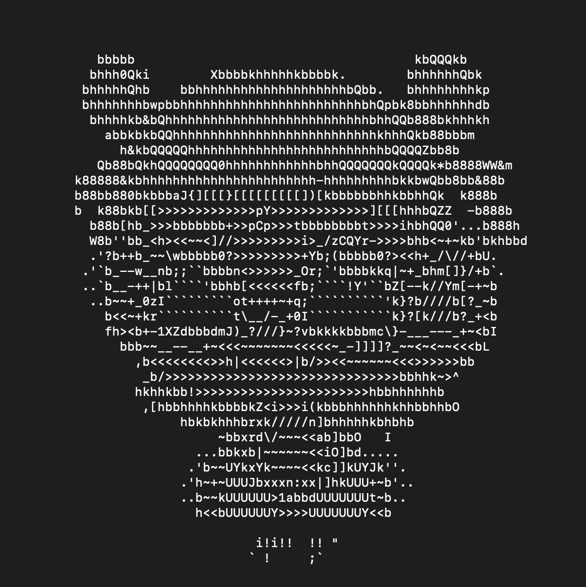

# ImgToChar 

transform an image to a txt

### dependency

- python3
- opencv-python

### usage

```python
python img2char.py
```

or

```python
python img2char.py --input input.png --output output.txt --width 100 --height 50
```

**PS: For good results, width twice the height is recommended **

### result

- input


- output



